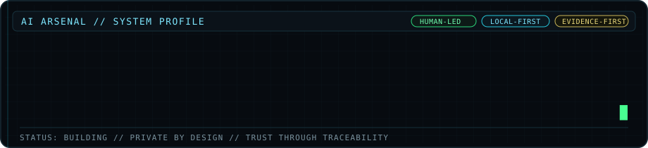

<p align="center">
  
</p>

# Oscar I. Holguin-Silva

**Applied AI Engineer | AI Systems Builder | Governed AI, Data & Workflow Automation**

I build practical AI and data systems that help people surface risk, reduce manual work, and make better decisions with clearer evidence. My focus is private, governed, human-led software rather than black-box automation.

[Portfolio](https://sophos333.github.io/OscarAIArsenal/) · [LinkedIn](https://www.linkedin.com/in/yashuasspear-oscar-holguin-silva/) · [AICR Documentation](https://github.com/Sophos333/aicr-documentation)

## What I Build

- **Applied AI systems** for real business workflows
- **Human-in-the-loop decision support** with explicit approval boundaries
- **Local-first and privacy-conscious AI** for sensitive information
- **Data and analytics products** that turn raw information into operational clarity
- **Workflow automation** with evidence, traceability, and controlled execution

## Selected Work

### AI Arsenal
A growing portfolio of AI, analytics, and workflow systems built around evidence, privacy, governance, and human judgment.

**[Explore the AI Arsenal portfolio](https://sophos333.github.io/OscarAIArsenal/)**

### AICR | AI Contract Reviewer
Private, human-led contract-review software designed to surface potential concerns and connect findings to supporting contract language so a person can review the evidence and decide what matters.

**[Read the public AICR documentation](https://github.com/Sophos333/aicr-documentation)**

### Scout
A configurable lead-intelligence system for discovering, researching, validating, and preparing prospects for governed human outreach. The product is being built privately while the customer workflow is refined.

### Aegis
A governance-first decision-intelligence system built around controlled data access, auditable workflows, and human oversight.

## Public Engineering & Analytics Work

| Project | Focus |
| --- | --- |
| [AI Arsenal Portfolio](https://github.com/Sophos333/OscarAIArsenal) | Public portfolio and product case studies |
| [Cross-Department KPI Dashboard](https://github.com/Sophos333/cross-department-kpi-dashboard) | Power BI executive reporting across Finance, HR, and Operations |
| [Superstore Sales Analysis](https://github.com/Sophos333/superstore-sales-analysis) | Python, pandas, and BI analysis from raw data to business insight |
| [LA Crime Analysis](https://github.com/Sophos333/LA-Crime-Analysis-2020-2025) | Public-data analysis, trends, and operational visualization |

## Engineering Principles

```text
Evidence before confidence.
Human approval before consequential action.
Privacy and security by design.
Uncertainty should be visible, not hidden.
Small, testable changes beat speculative complexity.
AI should support judgment, not quietly replace it.
```

## Core Stack

**AI & Application Engineering:** Python · FastAPI · LLM/RAG workflows · Ollama · PyTorch · scikit-learn

**Data & Analytics:** SQL · pandas · NumPy · Power BI · Power Query · Jupyter · Databricks

**Systems & Delivery:** Docker · Git · GitHub · SQLite · SQL Server · VS Code · pytest

**Additional Development:** JavaScript · C#/.NET · HTML · CSS

## Databricks Academy

- Azure Databricks Platform Architect
- Generative AI Fundamentals
- AI Agent Fundamentals
- Databricks Fundamentals

[View Databricks credentials](https://credentials.databricks.com/profile/oscarholguinsilva/wallet)

## Background

U.S. Army veteran with a background spanning software, web architecture, analytics, process improvement, and organizational leadership. I bring that same emphasis on accountability, clarity, and disciplined execution into the systems I build today.

## Current Direction

I am building AI Arsenal while working toward practical, sellable AI products for contract review, lead intelligence, workflow automation, and governed decision support.

I am also open to **contract work, product collaborations, and applied AI engineering opportunities** where evidence, privacy, and human accountability matter.

## Connect

- [LinkedIn](https://www.linkedin.com/in/yashuasspear-oscar-holguin-silva/)
- [AI Arsenal Portfolio](https://sophos333.github.io/OscarAIArsenal/)
- [GitHub](https://github.com/Sophos333)
